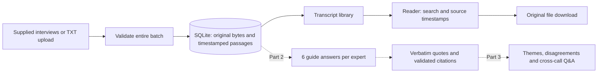
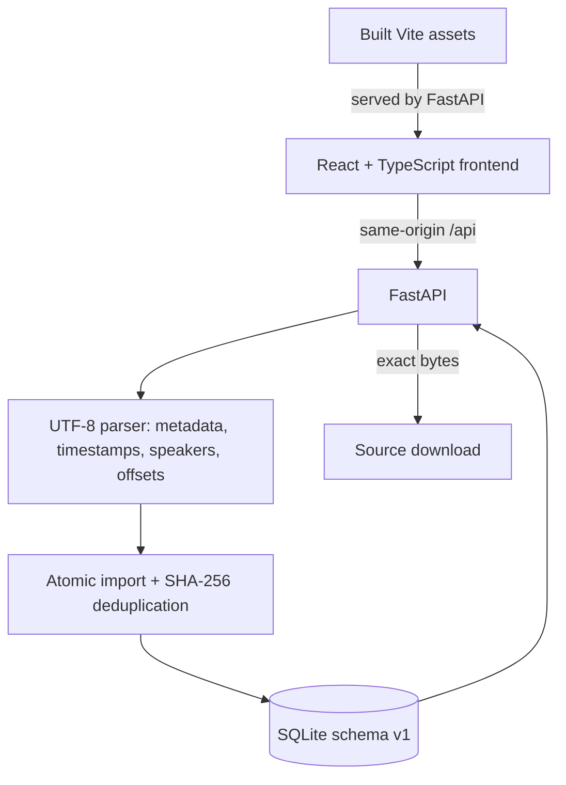
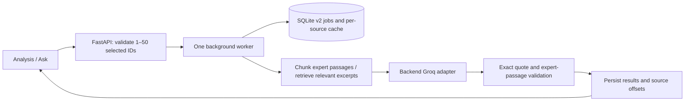

# Product and architecture

## Required outcome

Convert three expert interviews into answers to the six guide questions per expert, evidence-backed quotes, common themes and disagreements, and cross-transcript Q&A. Important answers must be traceable to actual source passages. This Part 1 establishes the source layer only.

## Part 1 implementation

API endpoints: GET `/api/health`, GET `/api/transcripts`, GET `/api/transcripts/{id}`, GET `/api/transcripts/{id}/source`, POST `/api/transcripts` (multipart field `files`), POST `/api/samples`.

Transcripts store an immutable ID, source hash, original filename, expert, role, market, original bytes, and parsed passages. Each passage stores ordinal, timestamp, seconds, speaker, expert flag, text, and exact source character offsets. A JSON passage column is sufficient for these small transcripts; separate indexed passage tables can follow if required. All SQL parameters are bound. React renders plain text. Obsolete detail requests are aborted and ID-checked.

## Delivery gates

| Part | Working result | Approval gate |
|---|---|---|
| 1 | Upload, persistent library, source reader and responsive UI | User runs the ZIP and checks the workflow |
| 2 | 18 guide answers, verbatim quotes, validated source citations and uncertainty handling | Test against all supplied interviews; user verifies |
| 3 | Themes, carefully scoped disagreements, cross-call Q&A and submission documentation | End-to-end checks and user demo |

For Part 2, use a backend-only model provider adapter. For three short transcripts, explicit full-context extraction is simpler than a vector database. Validate every returned quote against its cited source span. Unsupported claims should be marked as insufficient evidence. Preserve conditions and geographic scope when comparing growth estimates; a centre-level estimate is not automatically a market-wide contradiction.

At 30+ transcripts, add queued ingestion/extraction, bounded concurrency, per-source caching and passage retrieval when the context budget requires it. Keep original source IDs and offsets through that change. These are architecture notes, not extra implemented features.

## Implemented analysis extension

This supersedes the future-work notes above. Uploads accept 50 files, 2 MiB each and 50 MiB per batch. Jobs process one source at a time, persist progress, support cancellation after the current request and mark interrupted work on restart. Re-running reuses successful source caches. Only one server worker/process should use a project database: coordination is in-process, not a distributed queue.

Ask scores expert excerpts by query-word overlap, reserves one per interview, then fills a 64,000-character budget with further excerpts. Short interviews fit in full; each excerpt is at most 1,200 characters. It reports excerpt coverage. A vector database and semantic embeddings are not implemented. Synthesis uses compact validated answers and requires two distinct source IDs for each displayed comparison. Distinct IDs do not establish independent people if duplicate experts are uploaded under different source files.

Quote validation prevents fabricated spans and interviewer attribution; it cannot prove semantic entailment. The UI renders output as plain React text. Provider errors are sanitized, keys are loaded backend-only, and the local app remains bound to 127.0.0.1. Groq uses strict JSON-schema responses; exact quote checks remain server-side. Provider quotas and retrieval coverage remain limitations.
